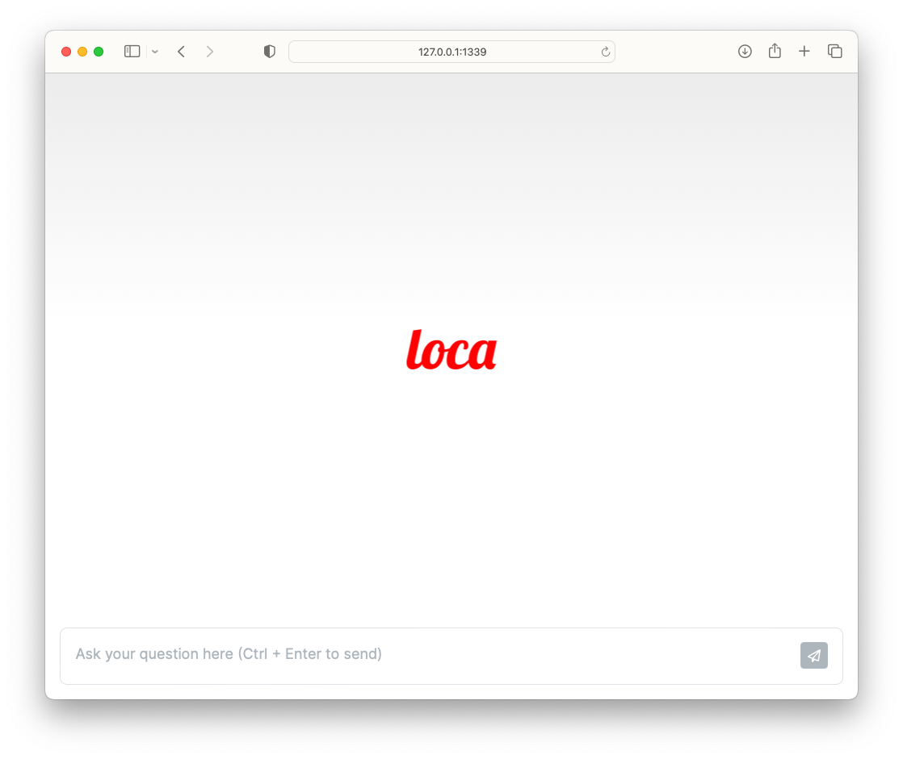
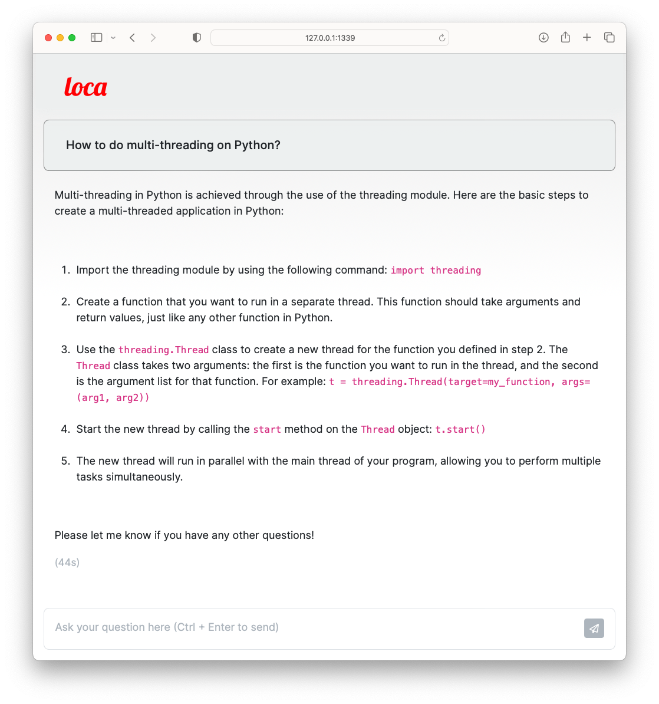

Loca is a simple (just 1 file!) chatbot that wraps around a local LLM like Llama-2-7B-chat.

Here are some screenshots of Loca.





## Setup

First, clone this repository.

```
$ git clone https://github.com/sausheong/loca.git
```

Now, assuming you already have Python on your laptop, go to the directory and install all the requirements.

```
$ pip install -r requirements.txt
```

Next, download the model you want to use. You can go to this site at HuggingFace to download the model -- https://huggingface.co/TheBloke/Llama-2-7B-Chat-GGML/tree/main. The model `llama-2-7b-chat.ggmlv3.q8_0.bin` works well.

Then go into the `.env` file and modify the path to the model file as necessary. I assume that you will be placing the models in a directory named `models` but that's entirely up to you.

You're all done!

## Running Loca

Just go the the terminal and type this:

```
$ python loca.py
```

